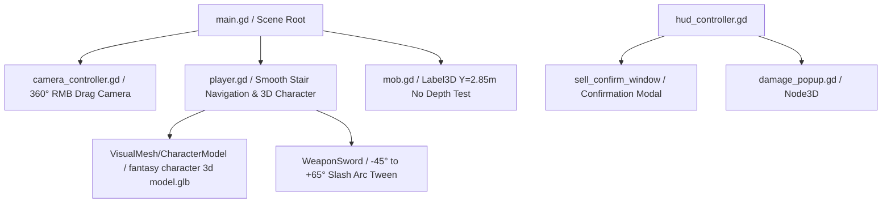

# Arquitetura Técnica e Contexto do Projeto (CONTEXT.md)

Este documento descreve a arquitetura interna, o fluxo de execução, as fórmulas matemáticas e as decisões de design técnico do projeto **Aeon Fantasy**.

---

## 🛠️ Visão Geral da Arquitetura

O projeto utiliza uma arquitetura modular orientada a objetos na **Godot Engine 4**, combinando física 3D (`CharacterBody3D`, `StaticBody3D`), rotação livre de câmera 360º (`CameraController`), interface 2D (`CanvasLayer`, `Control`), e cálculo em tempo real de estatísticas MMORPG inspiradas em *Ragnarok Online* e *MU Online*.

---

## 📐 Componentes e Módulos Principais

### 1. `scripts/camera_controller.gd` (Câmera Livre 360º)
- **Rotação Livre H/V (RMB Drag)**:
  - **Yaw (Giro 360º)**: `rotation.y -= event.relative.x * mouse_sensitivity`.
  - **Pitch (Inclinação Vertical)**: `pitch_angle_degrees` limitado entre $15^\circ$ e $85^\circ$ via `clamp`.
  - **Sensibilidade**: `mouse_sensitivity = 0.005` rad/px.
  - **Teclas Auxiliares**: `Q` / `E` para rotação em $90^\circ$ e `R` para reset instantâneo a $45^\circ$.

### 2. Personagem 3D (`assets/fantasy character 3d model.glb`)
- **Malha 3D e Escala**: Instanciada em `NavigationRegion3D/Player/VisualMesh/CharacterModel` com escala $2.6\times$ e offset de $-1.2\text{m}$ no eixo Y.
- **Forma de Colisão**: `CapsuleShape3D` com raio de $0.6\text{m}$ e altura de $2.4\text{m}$.
- **Animações Procedurais e Espada**:
  - `walk_anim_time`: Bobbing vertical do nó `VisualMesh` durante o movimento.
  - `WeaponSword`: Acoplada ao nó `HandRight` com rotação de golpe de $-45^\circ$ a $+65^\circ$ durante ataques.

### 3. `scripts/mob.gd` (Rótulo 3D Flutuante do Boss)
- **Elevação e no_depth_test**:
  - `hp_label.position = Vector3(0, 2.85, 0)` quando `is_boss == true`.
  - Configurado com `no_depth_test = true` e `billboard = BILLBOARD_ENABLED`, impedindo clipping com a malha $2.5\times$ maior do Boss e mantendo o rótulo legível flutuando acima da cabeça em qualquer ângulo 3D.
