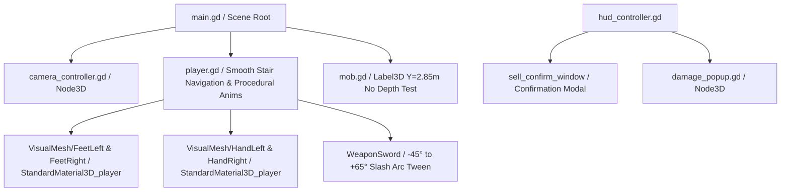

# Arquitetura Técnica e Contexto do Projeto (CONTEXT.md)

Este documento descreve a arquitetura interna, o fluxo de execução, as fórmulas matemáticas e as decisões de design técnico do projeto **Aeon Fantasy**.

---

## 🛠️ Visão Geral da Arquitetura

O projeto utiliza uma arquitetura modular orientada a objetos na **Godot Engine 4**, combinando física 3D (`CharacterBody3D`, `StaticBody3D`), interface 2D (`CanvasLayer`, `Control`), e cálculo em tempo real de estatísticas MMORPG inspiradas em *Ragnarok Online* e *MU Online*.

---

## 📐 Componentes e Módulos Principais

### 1. `scripts/mob.gd` (Rótulo 3D Flutuante do Boss)
- **Elevação e no_depth_test**:
  - `hp_label.position = Vector3(0, 2.85, 0)` quando `is_boss == true`.
  - Configurado com `no_depth_test = true` e `billboard = BILLBOARD_ENABLED`, impedindo clipping com a malha $2.5\times$ maior do Boss e mantendo o rótulo legível flutuando acima da cabeça em qualquer ângulo.
