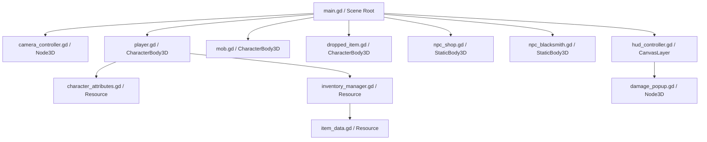

# Arquitetura Técnica e Contexto do Projeto (CONTEXT.md)

Este documento descreve a arquitetura interna, o fluxo de execução, as fórmulas matemáticas e as decisões de design técnico do projeto **Aeon Fantasy**.

---

## 🛠️ Visão Geral da Arquitetura

O projeto utiliza uma arquitetura modular orientada a objetos na **Godot Engine 4**, combinando física 3D (`CharacterBody3D`, `StaticBody3D`), interface 2D (`CanvasLayer`, `Control`), e cálculo em tempo real de estatísticas MMORPG inspiradas em *Ragnarok Online* e *MU Online*.

---

## 📐 Componentes e Módulos Principais

### 1. `scripts/camera_controller.gd` (`CameraController`)
- **Tipo**: `Node3D`
- **Seguimento Suave**: Acompanha o nó `target_node` (Jogador) via interpolação linear suave (`lerp`).
- **Passos de Rotação**: Gira o pivô da câmera em passos discretos de 90° acionados por `Q` / `E` / `Setas`.

---

### 2. `scripts/player.gd` (`Player`)
- **Tipo**: `CharacterBody3D`
- **Movimentação Point-and-Click**: Calcula o caminho até o ponto clicado no terreno e movimenta via `move_and_slide()`.
- **Trava de Mira & Ataque Fixo por ASPD**: A taxa de ataque é governada exclusivamente pelo cronômetro de ASPD (`attributes.get_attack_delay()`), ignorando cliques repetidos do mouse.
- **Degradação de Durabilidade**: Reduz a durabilidade da arma equipada ao atacar (`_perform_attack()`) e das armaduras/escudo ao receber dano (`take_damage_from()`).

---

### 3. `scripts/dropped_item.gd` (`DroppedItem`)
- **Tipo**: `CharacterBody3D`
- **Visual 3D**: Exibe malha 3D em rotação contínua e rótulo flutuante `Label3D` em modo Billboard com fundo escuro e cor condizente com a raridade do item.
- **Despawn Timer (20s)**: Timer interno remove o nó do mapa após 20 segundos.
- **Coleta por Proximidade / Barra de Espaço**:
  - Pressionar a tecla `KEY_SPACE` ou caminhar até o item dentro de $3.5\text{m}$ adiciona o item/moeda ao inventário.
  - Para sacos de Éons (`eons_pouch`), o valor em Éons é creditado diretamente na carteira com popup dourado `"+ X Éons"`.

---

### 4. `scripts/item_data.gd` (`ItemData`)
- **Tipo**: `Resource`
- **Serial UUID Anti-Dupe**: Cada item gera um identificador único alfanumérico (`uid`) em `generate_uid()` no momento de sua criação para prevenir duplicação em sistemas de Trade.
- **Durabilidade Escalável por Raridade**:
  - `COMMON`: 50 Max
  - `EXCELLENT`: 80 Max
  - `ANCIENT`: 120 Max
  - `GALACTIC`: 200 Max
- **Eficácia e Penalidade ao Quebrar (`get_effective_stats()`)**:
  - Quando `current_durability <= 0`, multiplica todos os bônus de atributos por $0.20$ (perda de 80% dos status originais).

---

### 5. `scripts/inventory_manager.gd` (`InventoryManager`)
- **Mochila & Equipamentos**: 35 slots na mochila e 13 slots ativados na aba de equipamentos (Paper Doll).
- **Carteira de Moedas**: Armazena saldos de **Éons (`eons`)** e **Astris (`astris`)** com métodos `add_eons()`, `remove_eons()`, `add_astris()`, `remove_astris()` e sinal `currency_changed`.
- **Cálculo de Status Efetivos**: `get_total_equipment_bonuses()` consulta `item.get_effective_stats()`, recalculando em tempo real as estatísticas do personagem conforme itens sofrem danos ou são reparados.
- **Métodos de Reparo**:
  - `get_repair_cost(item)`: Calcula o custo em Éons baseado na durabilidade ausente e multiplicador de raridade.
  - `repair_item(item)`: Repara um único item por Éons.
  - `repair_all_equipment()`: Repara simultaneamente todos os equipamentos danificados (equipados e na mochila).

---

### 6. `scripts/npc_shop.gd` & `scripts/npc_blacksmith.gd`
- **NPC Vendedor de Equipamentos (`Vector3(3, 0, 3)`)**: Abre a janela de loja (`shop_window`) permitindo comprar conjunto de armadura para iniciantes, espada, escudo e consumíveis por Éons.
- **NPC Ferreiro (`Vector3(-5, 0, 5)`)**: Posicionado em área aberta e desimpedida do cenário. Abre a janela da oficina de reparos (`blacksmith_window`).

---

### 7. `scripts/hud_controller.gd` (`HUDController`)
- **Tipo**: `CanvasLayer` (Camada 10).
- **Minimapa Radar**: Desenha o mapa e atualiza a posição do jogador (Verde), Mobs (Vermelho), Itens no chão (Dourado) e NPCs (Ciano).
- **Janelas Flutuantes e Arrastáveis**: Mochila (`[I]`), Atributos (`[C]`), Loja e Ferreiro suportam drag & drop através da barra superior via `_on_window_header_gui_input()`.
- **Inspector de Itens**: Exibe durabilidade `🔨 Durabilidade: 45 / 50` e alerta em vermelho `🔴 QUEBRADO (-80%)` quando o item atinge 0 de durabilidade.
- **Fechamento Automático de Janelas**: Método `close_npc_windows()` fecha automaticamente as janelas ativas ao se movimentar ou interagir com o mapa.

---

## 🧮 Fórmulas Matemáticas e Físicas

1. **HP e SP Máximos**:
   - $\text{Max HP} = 100 + (\text{Level} \times 35) + (\text{Total VIT} \times 12) + (\text{Total VIT}^2 \times 0.1)$
   - $\text{Max SP} = 30 + (\text{Level} \times 8) + (\text{Total INT} \times 5)$

2. **Ataque Físico (ATK)**:
   - $\text{ATK} = \frac{\text{Level}}{4} + \text{Total STR} + \left(\frac{\text{Total STR}}{10}\right)^2 + \frac{\text{Total DEX}}{5} + \frac{\text{Total LUK}}{5} + \text{Bônus Equip. Efetivos}$

3. **Velocidade de Ataque (ASPD)**:
   - $\text{ASPD} = \text{clamp}(140.0 + (\text{Total AGI} \times 0.45) + (\text{Total DEX} \times 0.09) + \text{Bônus Equip. ASPD}, 100.0, 190.0)$
   - $\text{Delay de Ataque (Segundos)} = \frac{200.0 - \text{ASPD}}{50.0}$

4. **Taxa de Acerto e Dano (HIT vs FLEE & Hard DEF)**:
   - $\text{Chance de Hit (\%)} = \text{clamp}(80.0 + \text{Attacker HIT} - \text{Defender FLEE}, 5.0, 100.0)$
   - $\text{Dano Final} = \text{Dano Base} \times \left(1.0 - \frac{\text{Hard DEF}}{\text{Hard DEF} + 100.0}\right) - \text{Soft DEF}$

5. **Capacidade de Carga de Peso**:
   - $\text{Capacidade de Peso (kg)} = 2000.0 + (\text{STR} \times 30.0)$

6. **Recompensa de Éons em Drops de Mobs**:
   - $\text{Quantidade de Éons} = \text{Level do Mob} \times \text{randi\_range}(12, 28)$
