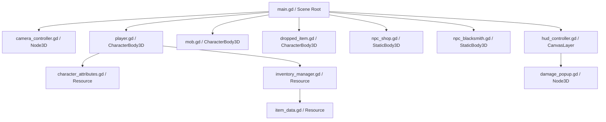

# Arquitetura Técnica e Contexto do Projeto (CONTEXT.md)

Este documento descreve a arquitetura interna, o fluxo de execução, as fórmulas matemáticas e as decisões de design técnico do projeto **Aeon Fantasy**.

---

## 🛠️ Visão Geral da Arquitetura

O projeto utiliza uma arquitetura modular orientada a objetos na **Godot Engine 4**, combinando física 3D (`CharacterBody3D`, `StaticBody3D`), interface 2D (`CanvasLayer`, `Control`), e cálculo em tempo real de estatísticas MMORPG inspiradas em *Ragnarok Online* e *MU Online*.

---

## 📐 Componentes e Módulos Principais

### 1. `scripts/item_data.gd` (`ItemData`)
- **Tipo**: `Resource`
- **Joias de Refinamento**:
  - `jewel_simplicity`: Refina de **+0 até +6**.
  - `jewel_ethrel`: Refina de **+6 até +9**.
- **Fórmula de Bônus de Refinamento (`get_effective_stats()`)**:
  - Níveis $+1 \sim +6$: $+0.8333\%$ por nível (atingindo $+5.0\%$ no +6).
  - Níveis $+7 \sim +9$: $+1.6666\%$ por nível adicional (totalizando $+10.0\%$ no +9).
  - Multiplicador total: $\text{Total Mult} = (1.0 + \text{Upgrade Pct}) \times \text{Durability Mult}$.
- **Requisitos de Atributos por Arquétipo de Classe (`req_stats`)**:
  - **Drakenyel** (Warrior): Requer `STR` e `VIT`.
  - **Birdyel** (Assassin/Speed): Requer `AGI` e `DEX`.
  - **Nekunyel** (Mage): Requer `INT` e `DEX`.
  - **Elfenyel** (Ranger/Archer): Requer `DEX` e `LUK`.

---

### 2. `scripts/inventory_manager.gd` (`InventoryManager`)
- **Validação ao Equipar (`can_equip_item()`)**:
  - Consulta os atributos do jogador em `character_attributes.get_stat_value(stat_key)` (base + bônus de equipamentos).
  - Se o jogador não possuir os valores exigidos em `req_stats`, o equipamento é recusado e exibe o aviso popup `"Requer: STR 30!"`.
- **Refinamento com Joias (`apply_jewel_to_item()`)**:
  - Valida se a joia utilizada é compatível com o nível atual do item (+0~+5 para Simplicity, +6~+8 para Ethrel).
  - Eleva `upgrade_level` em +1, consome 1 joia da mochila e recalcula os atributos do jogador.

---

### 3. `scripts/character_attributes.gd` (`CharacterAttributes`)
- **Método `get_stat_value(stat_key: String) -> int`**:
  - Retorna o valor total combinado (atributo distribuído pelo jogador + bônus concedidos por itens equipados) para validações de requisitos de classe e equipamentos.

---

### 4. `scripts/hud_controller.gd` (`HUDController`)
- **Inspetor de Itens Atualizado**:
  - Exibe o nome formatado do item com nível de refinamento (ex: `+6 Lâmina do Caçador`).
  - Exibe os requisitos de classe em tempo real com marcadores verdes (atendido) ou vermelhos (insuficiente): `📜 Requisitos: STR 12 🟢, VIT 10 🔴`.
- **Refinamento por Drag & Drop / Clique Direito**:
  - Arrastar a joia sobre um equipamento na mochila invoca `apply_jewel_to_item()` com feedback visual em popup reluzente estilo RO.

---

## 🧮 Fórmulas Matemáticas e Físicas

1. **Bônus Percentual por Nível de Refinamento (+0 a +9)**:
   $$\text{Upgrade Pct} = \begin{cases} 0.0 & \text{se } \text{level} = 0 \\ \text{level} \times 0.008333 & \text{se } 1 \le \text{level} \le 6 \quad (\text{Max } +5\%) \\ 0.05 + (\text{level} - 6) \times 0.016666 & \text{se } 7 \le \text{level} \le 9 \quad (\text{Max } +10\%) \end{cases}$$

2. **Atributo Efetivo Final do Item**:
   $$\text{Atributo Final} = \text{max}\left(1, \text{round}\left(\text{Atributo Base} \times (1.0 + \text{Upgrade Pct}) \times \text{Durability Mult}\right)\right)$$

3. **Escala de Requisitos de Atributos por Raridade**:
   $$\text{Atributo Requerido} = \text{round}(\text{Requisito Base} \times \text{Rarity Multiplier})$$
