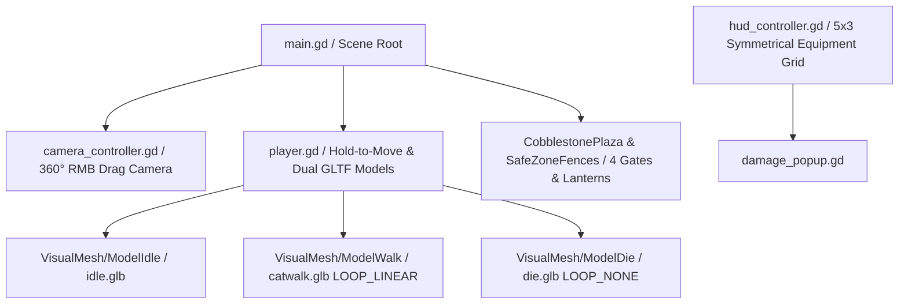

# Arquitetura Técnica e Contexto do Projeto (CONTEXT.md)

Este documento descreve a arquitetura interna, o fluxo de execução, os sistemas de animação GLTF/GLB e as decisões de design técnico do projeto **Aeon Fantasy**.

---

## 🛠️ Visão Geral da Arquitetura

O projeto utiliza uma arquitetura modular na **Godot Engine 4**, integrando física 3D (`CharacterBody3D`, `StaticBody3D`), rotação de câmera 360º (`CameraController`), praça central Safe Zone, troca dinâmica de modelos 3D com animação esquelética, interface 2D (`CanvasLayer`, `Control`), e estatísticas em tempo real inspiradas em *Ragnarok Online* e *MU Online*.

---

## 📐 Componentes e Módulos Principais

### 1. `scripts/camera_controller.gd` (Câmera Livre 360º)
- **Rotação Livre H/V (RMB Drag)**:
  - **Yaw (Giro 360º)**: `rotation.y -= event.relative.x * mouse_sensitivity`.
  - **Pitch (Inclinação Vertical)**: `pitch_angle_degrees` limitado entre $15^\circ$ e $85^\circ$ via `clamp`.
  - **Sensibilidade**: `mouse_sensitivity = 0.005` rad/px.
  - **Teclas Auxiliares**: `Q` / `E` para rotação em $90^\circ$ e `R` para reset instantâneo a $45^\circ$.

### 2. Personagem 3D & Gerenciador de Animações GLB (`scripts/player.gd`)
- **Sistema de Modelos Múltiplos GLB (Multi-Model State Machine)**:
  - `ModelIdle` (`assets/idle.glb`): Exibido quando parado.
  - `ModelWalk` (`assets/catwalk.glb`): Exibido durante o movimento (`LOOP_LINEAR`).
  - `ModelDie` (`assets/die.glb`): Exibido ao zerar o HP (`LOOP_NONE`).
  - `ModelAttackDrakunyel` (`assets/attackdrakunyel.glb`): Exibido ao realizar um ataque ao mob.
  - `ModelHitDrakunyel` (`assets/hitdrakunyel.glb`): Exibido ao receber um golpe do mob.
- **Ancoragem Dinâmica de Armas 3D (`fantasy+sword+3d+model.glb`)**:
  - Item Galáctico `Fantasy Sword Emerald Pursuit` instanciado em 3D.
  - **Fora de Ataque**: Acoplado ao nó `BackWeaponAnchor` nas costas do personagem em posição diagonal, com a ponta apontada para baixo.
  - **Durante o Ataque**: Acoplado temporariamente à mão direita (`HandRight`) acompanhando o golpe da espada.
- **Sistema de Combate Assíncrono e Individual**:
  - Temporizadores de ataque independentes para o Jogador (`attributes.get_attack_delay()`) e para cada Mob (`attack_cooldown`).
  - Vento-up inicial dinâmico para evitar acoplamento síncrono de acertos simultâneos no frame zero.

### 3. Safe Zone & Cidade Central (`scenes/main.tscn`)
- **Piso de Paralelepípedo (`CobblestonePlaza`)**: Malha `PlaneMesh` de $21\text{m} \times 19\text{m}$ com material de rocha.
- **Cercas e Portões**: 
  - `scenes/fence_wood.tscn`: Segmentos de cerca de madeira com física `StaticBody3D`.
  - `scenes/fence_post_gate.tscn`: Postes de portão com topo dourado e `OmniLight3D` lanterna quente.
  - Fechamento geométrico perfeito nos 4 cantos (`X = ±10.5m`, `Z = ±9.5m`).

### 4. `scripts/hud_controller.gd` (Interface & Equipamentos)
- **Grade 5x3 Simétrica de Equipamentos**: 15 slots organizados simetricamente no painel de equipamentos.
- **Preenchimento Inicial de Barras**: `bar_hp`, `bar_sp`, `bar_base_exp` e `bar_job_exp` inicializam preenchidos ao carregar o nó do jogador.
